# Multi-Environment Secret Manager Architecture

## Overview

The Multi-Environment Secret Manager is a production-ready Python library designed to provide secure, scalable, and
efficient access to Google Cloud Secret Manager across multiple environments. It implements enterprise-grade patterns
including connection pooling, caching, circuit breaking, and built-in observability.

## Table of Contents

- [Architecture Overview](#architecture-overview)
- [Core Components](#core-components)
- [Data Flow](#data-flow)
- [Security Architecture](#security-architecture)
- [Performance & Scalability](#performance--scalability)
- [Deployment Patterns](#deployment-patterns)
- [Integration Patterns](#integration-patterns)
- [Monitoring & Observability](#monitoring--observability)

## Architecture Overview

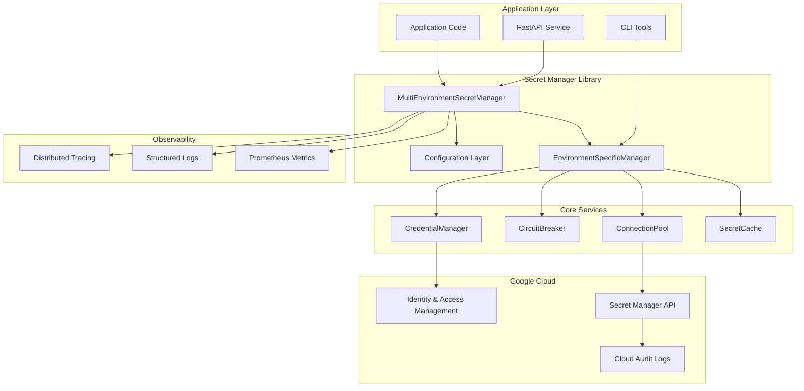
```mermaid
graph TB
    subgraph "Application Layer"
        APP[Application Code]
        API[FastAPI Service]
        CLI[CLI Tools]
    end

    subgraph "Secret Manager Library"
        MGR[MultiEnvironmentSecretManager]
        ENV[EnvironmentSpecificManager]
        CFG[Configuration Layer]
    end

    subgraph "Core Services"
        CACHE[SecretCache]
        POOL[ConnectionPool]
        CB[CircuitBreaker]
        CREDS[CredentialManager]
    end

    subgraph "Google Cloud"
        SM[Secret Manager API]
        IAM[Identity & Access Management]
        AUDIT[Cloud Audit Logs]
    end

    subgraph "Observability"
        METRICS[Prometheus Metrics]
        LOGS[Structured Logs]
        TRACES[Distributed Tracing]
    end

    APP --> MGR
    API --> MGR
    CLI --> ENV
    MGR --> ENV
    MGR --> CFG
    ENV --> CACHE
    ENV --> POOL
    ENV --> CB
    ENV --> CREDS
    POOL --> SM
    CREDS --> IAM
    MGR --> METRICS
    MGR --> LOGS
    MGR --> TRACES
    SM --> AUDIT
```

## Core Components

### 1. Multi-Environment Secret Manager

The central orchestrator that manages secret access across multiple environments with strict isolation and configuration
management.

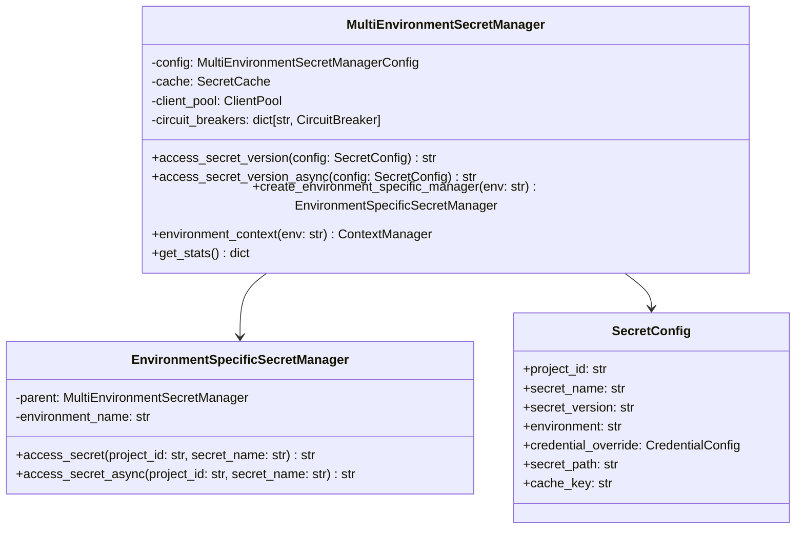
```mermaid
classDiagram
    class MultiEnvironmentSecretManager {
        -config: MultiEnvironmentSecretManagerConfig
        -cache: SecretCache
        -client_pool: ClientPool
        -circuit_breakers: dict[str, CircuitBreaker]
        +access_secret_version(config: SecretConfig) str
        +access_secret_version_async(config: SecretConfig) str
        +create_environment_specific_manager(env: str) EnvironmentSpecificSecretManager
        +environment_context(env: str) ContextManager
        +get_stats() dict
    }

    class EnvironmentSpecificSecretManager {
        -parent: MultiEnvironmentSecretManager
        -environment_name: str
        +access_secret(project_id: str, secret_name: str) str
        +access_secret_async(project_id: str, secret_name: str) str
    }

    class SecretConfig {
        +project_id: str
        +secret_name: str
        +secret_version: str
        +environment: str
        +credential_override: CredentialConfig
        +secret_path: str
        +cache_key: str
    }

    MultiEnvironmentSecretManager --> EnvironmentSpecificSecretManager
    MultiEnvironmentSecretManager --> SecretConfig
```

### 2. Configuration Architecture

Hierarchical configuration system supporting multiple credential methods and environment-specific settings.

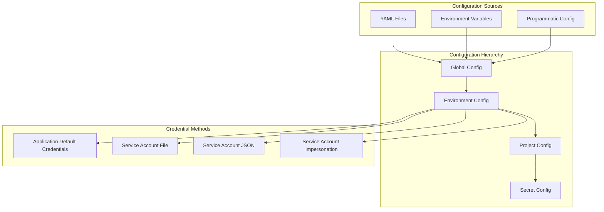
```mermaid
graph TD
    subgraph "Configuration Sources"
        YAML[YAML Files]
        ENV[Environment Variables]
        CODE[Programmatic Config]
    end

    subgraph "Configuration Hierarchy"
        GLOBAL[Global Config]
        ENV_CFG[Environment Config]
        PROJ[Project Config]
        SECRET[Secret Config]
    end

    subgraph "Credential Methods"
        ADC[Application Default Credentials]
        SA_FILE[Service Account File]
        SA_JSON[Service Account JSON]
        IMPERSONATE[Service Account Impersonation]
    end

    YAML --> GLOBAL
    ENV --> GLOBAL
    CODE --> GLOBAL

    GLOBAL --> ENV_CFG
    ENV_CFG --> PROJ
    PROJ --> SECRET

    ENV_CFG --> ADC
    ENV_CFG --> SA_FILE
    ENV_CFG --> SA_JSON
    ENV_CFG --> IMPERSONATE
```

### 3. Connection Management

Sophisticated connection pooling and lifecycle management for optimal resource utilization.

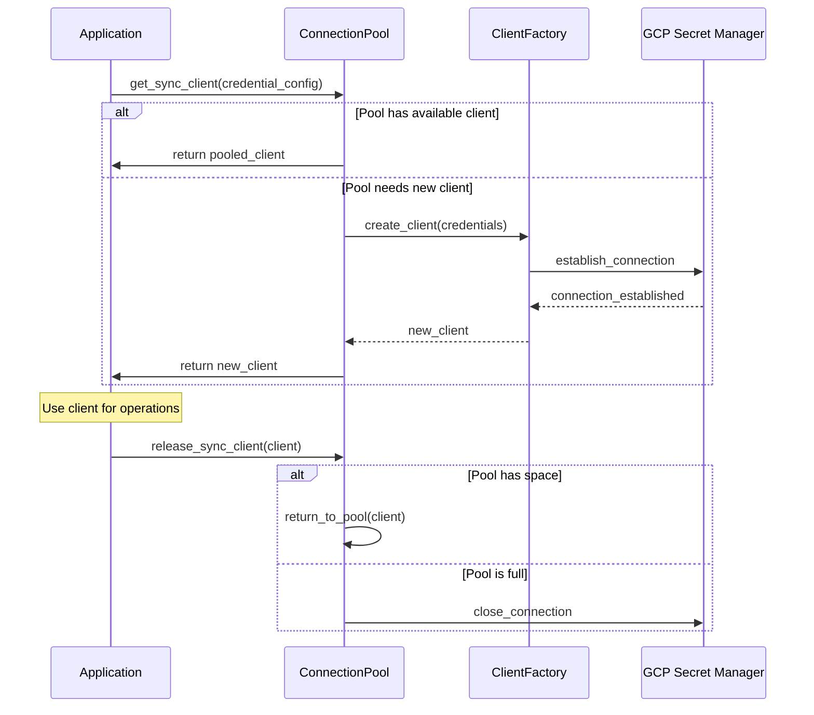
```mermaid
sequenceDiagram
    participant App as Application
    participant Pool as ConnectionPool
    participant Factory as ClientFactory
    participant GCP as GCP Secret Manager
    App ->> Pool: get_sync_client(credential_config)

    alt Pool has available client
        Pool ->> App: return pooled_client
    else Pool needs new client
        Pool ->> Factory: create_client(credentials)
        Factory ->> GCP: establish_connection
        GCP -->> Factory: connection_established
        Factory -->> Pool: new_client
        Pool ->> App: return new_client
    end

    Note over App: Use client for operations
    App ->> Pool: release_sync_client(client)

    alt Pool has space
        Pool ->> Pool: return_to_pool(client)
    else Pool is full
        Pool ->> GCP: close_connection
    end
```

### 4. Caching Strategy

Multi-level caching with TTL management and cache coherency.

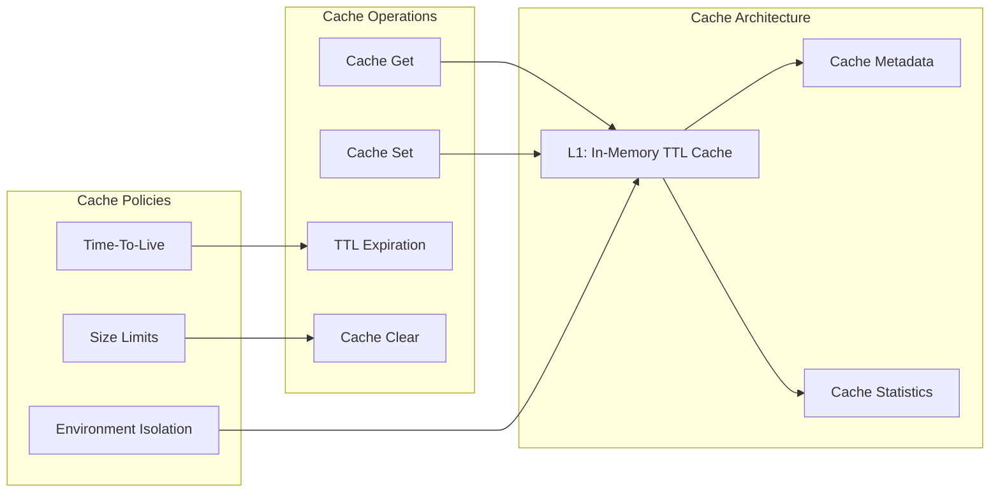
```mermaid
graph LR
    subgraph "Cache Architecture"
        L1[L1: In-Memory TTL Cache]
        META[Cache Metadata]
        STATS[Cache Statistics]
    end

    subgraph "Cache Operations"
        GET[Cache Get]
        SET[Cache Set]
        EXPIRE[TTL Expiration]
        CLEAR[Cache Clear]
    end

    subgraph "Cache Policies"
        TTL[Time-To-Live]
        SIZE[Size Limits]
        ENV[Environment Isolation]
    end

    GET --> L1
    SET --> L1
    L1 --> META
    L1 --> STATS

    TTL --> EXPIRE
    SIZE --> CLEAR
    ENV --> L1
```

## Data Flow

### Secret Access Flow

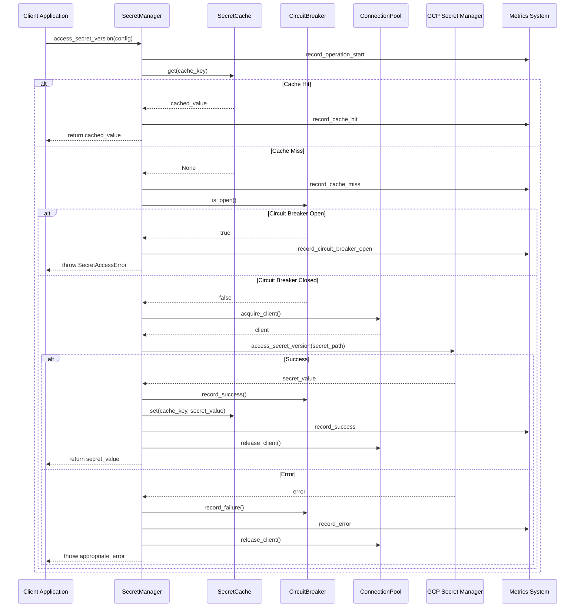
```mermaid
sequenceDiagram
    participant Client as Client Application
    participant Manager as SecretManager
    participant Cache as SecretCache
    participant CB as CircuitBreaker
    participant Pool as ConnectionPool
    participant GCP as GCP Secret Manager
    participant Metrics as Metrics System
    Client ->> Manager: access_secret_version(config)
    Manager ->> Metrics: record_operation_start
    Manager ->> Cache: get(cache_key)
    alt Cache Hit
        Cache -->> Manager: cached_value
        Manager ->> Metrics: record_cache_hit
        Manager -->> Client: return cached_value
    else Cache Miss
        Cache -->> Manager: None
        Manager ->> Metrics: record_cache_miss
        Manager ->> CB: is_open()
        alt Circuit Breaker Open
            CB -->> Manager: true
            Manager ->> Metrics: record_circuit_breaker_open
            Manager -->> Client: throw SecretAccessError
        else Circuit Breaker Closed
            CB -->> Manager: false
            Manager ->> Pool: acquire_client()
            Pool -->> Manager: client
            Manager ->> GCP: access_secret_version(secret_path)

            alt Success
                GCP -->> Manager: secret_value
                Manager ->> CB: record_success()
                Manager ->> Cache: set(cache_key, secret_value)
                Manager ->> Metrics: record_success
                Manager ->> Pool: release_client()
                Manager -->> Client: return secret_value
            else Error
                GCP -->> Manager: error
                Manager ->> CB: record_failure()
                Manager ->> Metrics: record_error
                Manager ->> Pool: release_client()
                Manager -->> Client: throw appropriate_error
            end
        end
    end
```

### Environment Context Flow

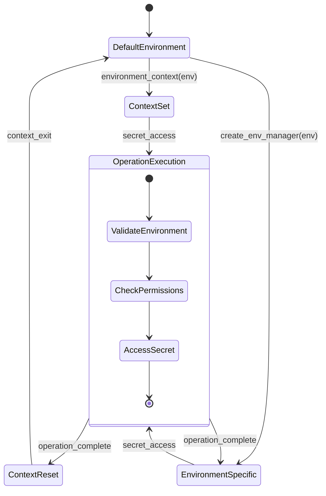
```mermaid
stateDiagram-v2
    [*] --> DefaultEnvironment
    DefaultEnvironment --> ContextSet: environment_context(env)
    ContextSet --> OperationExecution: secret_access
    OperationExecution --> ContextReset: operation_complete
    ContextReset --> DefaultEnvironment: context_exit
    DefaultEnvironment --> EnvironmentSpecific: create_env_manager(env)
    EnvironmentSpecific --> OperationExecution: secret_access
    OperationExecution --> EnvironmentSpecific: operation_complete

    state OperationExecution {
        [*] --> ValidateEnvironment
        ValidateEnvironment --> CheckPermissions
        CheckPermissions --> AccessSecret
        AccessSecret --> [*]
    }
```

## Security Architecture

### Authentication & Authorization

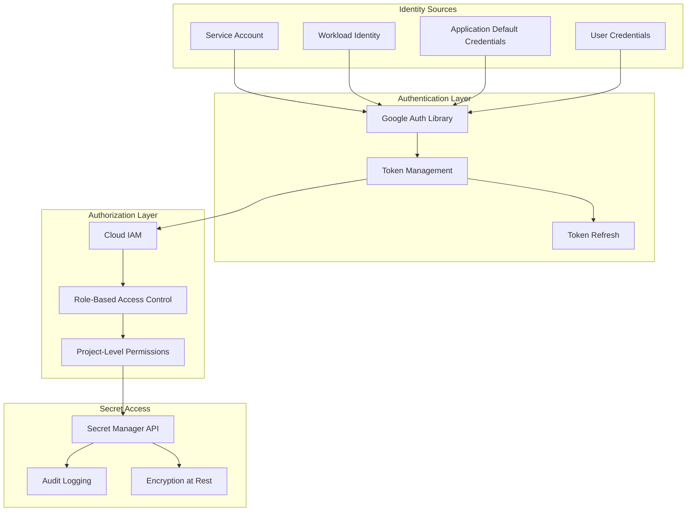
```mermaid
graph TB
    subgraph "Identity Sources"
        SA[Service Account]
        WI[Workload Identity]
        ADC[Application Default Credentials]
        USER[User Credentials]
    end

    subgraph "Authentication Layer"
        AUTH[Google Auth Library]
        TOKEN[Token Management]
        REFRESH[Token Refresh]
    end

    subgraph "Authorization Layer"
        IAM[Cloud IAM]
        RBAC[Role-Based Access Control]
        PROJ[Project-Level Permissions]
    end

    subgraph "Secret Access"
        SM[Secret Manager API]
        AUDIT[Audit Logging]
        ENCRYPT[Encryption at Rest]
    end

    SA --> AUTH
    WI --> AUTH
    ADC --> AUTH
    USER --> AUTH

    AUTH --> TOKEN
    TOKEN --> REFRESH

    TOKEN --> IAM
    IAM --> RBAC
    RBAC --> PROJ

    PROJ --> SM
    SM --> AUDIT
    SM --> ENCRYPT
```

### Environment Isolation

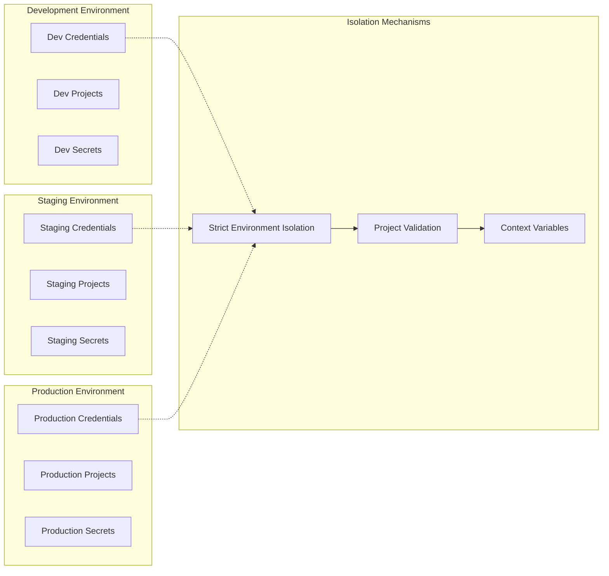
```mermaid
graph LR
    subgraph "Development Environment"
        DEV_CREDS[Dev Credentials]
        DEV_PROJECTS[Dev Projects]
        DEV_SECRETS[Dev Secrets]
    end

    subgraph "Staging Environment"
        STAGE_CREDS[Staging Credentials]
        STAGE_PROJECTS[Staging Projects]
        STAGE_SECRETS[Staging Secrets]
    end

    subgraph "Production Environment"
        PROD_CREDS[Production Credentials]
        PROD_PROJECTS[Production Projects]
        PROD_SECRETS[Production Secrets]
    end

    subgraph "Isolation Mechanisms"
        STRICT[Strict Environment Isolation]
        VALIDATION[Project Validation]
        CONTEXT[Context Variables]
    end

    DEV_CREDS -.-> STRICT
    STAGE_CREDS -.-> STRICT
    PROD_CREDS -.-> STRICT

    STRICT --> VALIDATION
    VALIDATION --> CONTEXT
```

## Performance & Scalability

### Connection Pooling Architecture

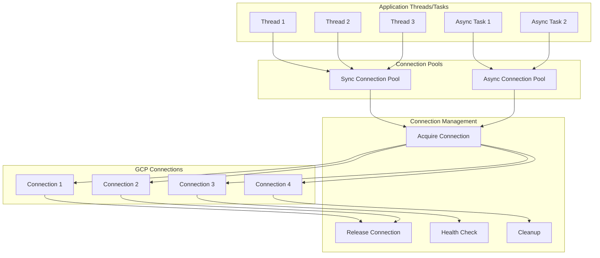
```mermaid
graph TB
    subgraph "Application Threads/Tasks"
        T1[Thread 1]
        T2[Thread 2]
        T3[Thread 3]
        A1[Async Task 1]
        A2[Async Task 2]
    end

    subgraph "Connection Pools"
        SYNC_POOL[Sync Connection Pool]
        ASYNC_POOL[Async Connection Pool]
    end

    subgraph "Connection Management"
        ACQUIRE[Acquire Connection]
        RELEASE[Release Connection]
        HEALTH[Health Check]
        CLEANUP[Cleanup]
    end

    subgraph "GCP Connections"
        CONN1[Connection 1]
        CONN2[Connection 2]
        CONN3[Connection 3]
        CONN4[Connection 4]
    end

    T1 --> SYNC_POOL
    T2 --> SYNC_POOL
    T3 --> SYNC_POOL
    A1 --> ASYNC_POOL
    A2 --> ASYNC_POOL

    SYNC_POOL --> ACQUIRE
    ASYNC_POOL --> ACQUIRE

    ACQUIRE --> CONN1
    ACQUIRE --> CONN2
    ACQUIRE --> CONN3
    ACQUIRE --> CONN4

    CONN1 --> RELEASE
    CONN2 --> RELEASE
    CONN3 --> HEALTH
    CONN4 --> CLEANUP
```

### Circuit Breaker Pattern

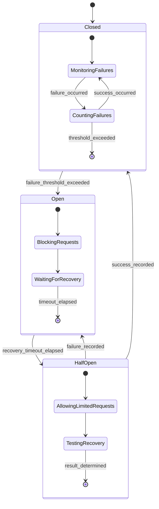
```mermaid
stateDiagram-v2
    [*] --> Closed

    Closed --> Open : failure_threshold_exceeded
    Open --> HalfOpen : recovery_timeout_elapsed
    HalfOpen --> Closed : success_recorded
    HalfOpen --> Open : failure_recorded

    state Closed {
        [*] --> MonitoringFailures
        MonitoringFailures --> CountingFailures : failure_occurred
        CountingFailures --> MonitoringFailures : success_occurred
        CountingFailures --> [*] : threshold_exceeded
    }

    state Open {
        [*] --> BlockingRequests
        BlockingRequests --> WaitingForRecovery
        WaitingForRecovery --> [*] : timeout_elapsed
    }

    state HalfOpen {
        [*] --> AllowingLimitedRequests
        AllowingLimitedRequests --> TestingRecovery
        TestingRecovery --> [*] : result_determined
    }
```

### Performance Optimization Strategies

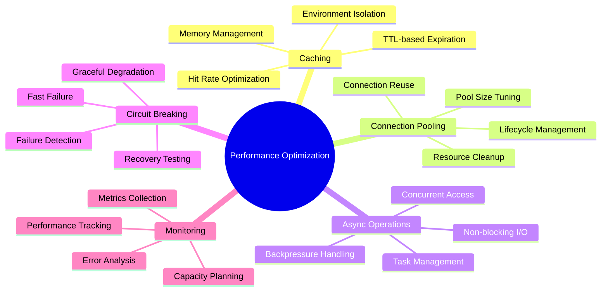
```mermaid
mindmap
    root((Performance Optimization))
        Caching
            TTL-based Expiration
            Environment Isolation
            Memory Management
            Hit Rate Optimization
        Connection Pooling
            Pool Size Tuning
            Connection Reuse
            Lifecycle Management
            Resource Cleanup
        Async Operations
            Concurrent Access
            Non-blocking I/O
            Task Management
            Backpressure Handling
        Circuit Breaking
            Failure Detection
            Fast Failure
            Graceful Degradation
            Recovery Testing
        Monitoring
            Metrics Collection
            Performance Tracking
            Error Analysis
            Capacity Planning
```

## Deployment Patterns

### Microservices Architecture

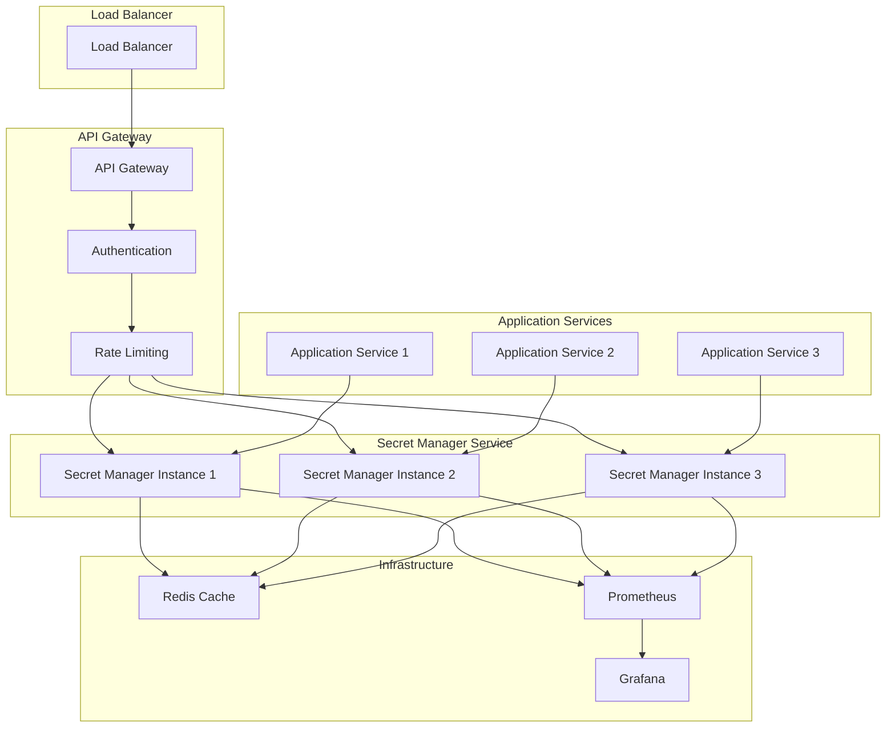
```mermaid
graph TB
    subgraph "Load Balancer"
        LB[Load Balancer]
    end

    subgraph "API Gateway"
        GW[API Gateway]
        AUTH[Authentication]
        RATE[Rate Limiting]
    end

    subgraph "Secret Manager Service"
        SM1[Secret Manager Instance 1]
        SM2[Secret Manager Instance 2]
        SM3[Secret Manager Instance 3]
    end

    subgraph "Application Services"
        APP1[Application Service 1]
        APP2[Application Service 2]
        APP3[Application Service 3]
    end

    subgraph "Infrastructure"
        REDIS[Redis Cache]
        PROM[Prometheus]
        GRAF[Grafana]
    end

    LB --> GW
    GW --> AUTH
    AUTH --> RATE
    RATE --> SM1
    RATE --> SM2
    RATE --> SM3

    APP1 --> SM1
    APP2 --> SM2
    APP3 --> SM3

    SM1 --> REDIS
    SM2 --> REDIS
    SM3 --> REDIS

    SM1 --> PROM
    SM2 --> PROM
    SM3 --> PROM

    PROM --> GRAF
```

### Kubernetes Deployment

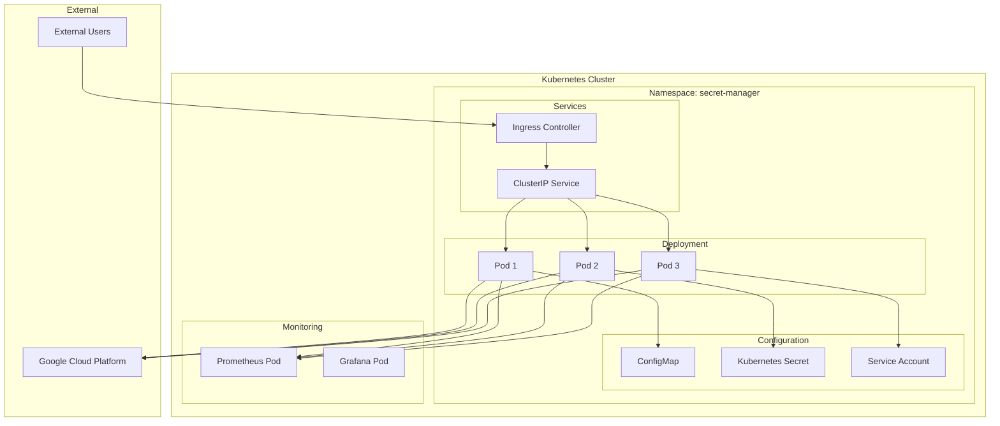
```mermaid
graph TB
    subgraph "Kubernetes Cluster"
        subgraph "Namespace: secret-manager"
            subgraph "Deployment"
                POD1[Pod 1]
                POD2[Pod 2]
                POD3[Pod 3]
            end

            subgraph "Services"
                SVC[ClusterIP Service]
                INGRESS[Ingress Controller]
            end

            subgraph "Configuration"
                CM[ConfigMap]
                SECRET[Kubernetes Secret]
                SA[Service Account]
            end
        end

        subgraph "Monitoring"
            PROM_POD[Prometheus Pod]
            GRAF_POD[Grafana Pod]
        end
    end

    subgraph "External"
        USERS[External Users]
        GCP[Google Cloud Platform]
    end

    USERS --> INGRESS
    INGRESS --> SVC
    SVC --> POD1
    SVC --> POD2
    SVC --> POD3

    POD1 --> CM
    POD2 --> SECRET
    POD3 --> SA

    POD1 --> GCP
    POD2 --> GCP
    POD3 --> GCP

    POD1 --> PROM_POD
    POD2 --> PROM_POD
    POD3 --> PROM_POD
```

## Integration Patterns

### Library Integration

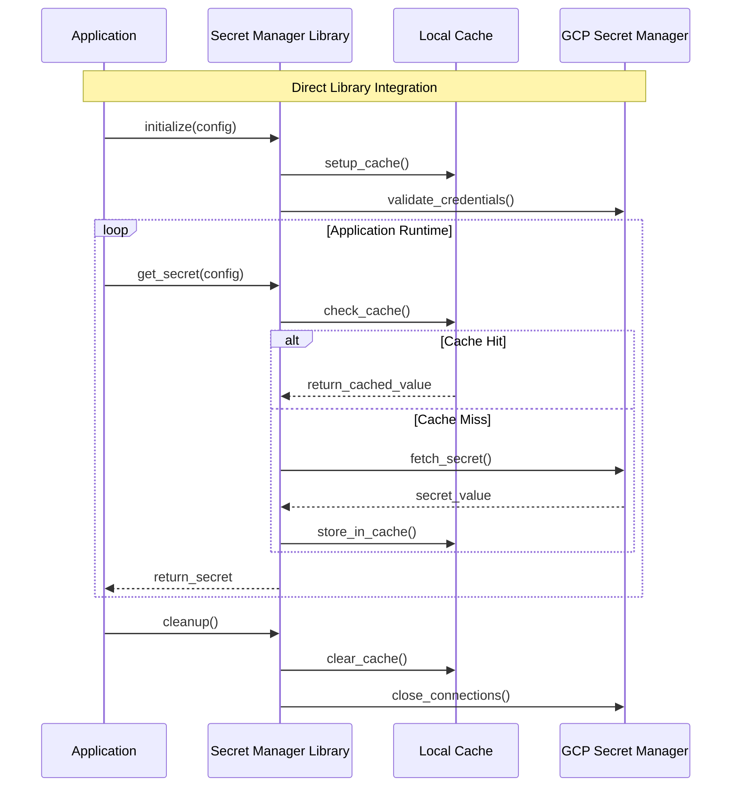
```mermaid
sequenceDiagram
    participant App as Application
    participant Lib as Secret Manager Library
    participant Cache as Local Cache
    participant GCP as GCP Secret Manager

    Note over App,GCP: Direct Library Integration

    App->>Lib: initialize(config)
    Lib->>Cache: setup_cache()
    Lib->>GCP: validate_credentials()

    loop Application Runtime
        App->>Lib: get_secret(config)
        Lib->>Cache: check_cache()
        alt Cache Hit
            Cache-->>Lib: return_cached_value
        else Cache Miss
            Lib->>GCP: fetch_secret()
            GCP-->>Lib: secret_value
            Lib->>Cache: store_in_cache()
        end
        Lib-->>App: return_secret
    end

    App->>Lib: cleanup()
    Lib->>Cache: clear_cache()
    Lib->>GCP: close_connections()
```

### Service Integration

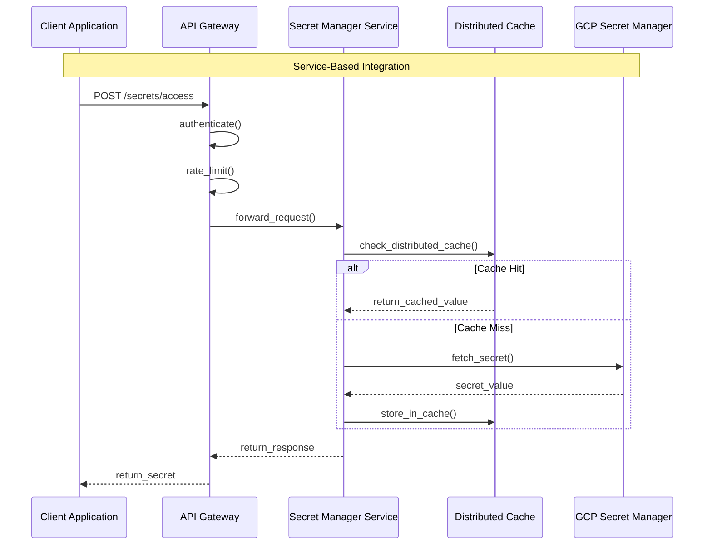
```mermaid
sequenceDiagram
    participant Client as Client Application
    participant Gateway as API Gateway
    participant Service as Secret Manager Service
    participant Cache as Distributed Cache
    participant GCP as GCP Secret Manager

    Note over Client,GCP: Service-Based Integration

    Client->>Gateway: POST /secrets/access
    Gateway->>Gateway: authenticate()
    Gateway->>Gateway: rate_limit()
    Gateway->>Service: forward_request()

    Service->>Cache: check_distributed_cache()
    alt Cache Hit
        Cache-->>Service: return_cached_value
    else Cache Miss
        Service->>GCP: fetch_secret()
        GCP-->>Service: secret_value
        Service->>Cache: store_in_cache()
    end

    Service-->>Gateway: return_response
    Gateway-->>Client: return_secret
```

### Event-Driven Integration

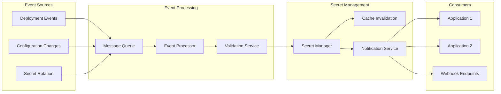
```mermaid
graph LR
    subgraph "Event Sources"
        DEPLOY[Deployment Events]
        CONFIG[Configuration Changes]
        ROTATION[Secret Rotation]
    end

    subgraph "Event Processing"
        QUEUE[Message Queue]
        PROCESSOR[Event Processor]
        VALIDATOR[Validation Service]
    end

    subgraph "Secret Management"
        MANAGER[Secret Manager]
        CACHE[Cache Invalidation]
        NOTIFY[Notification Service]
    end

    subgraph "Consumers"
        APP1[Application 1]
        APP2[Application 2]
        WEBHOOK[Webhook Endpoints]
    end

    DEPLOY --> QUEUE
    CONFIG --> QUEUE
    ROTATION --> QUEUE

    QUEUE --> PROCESSOR
    PROCESSOR --> VALIDATOR
    VALIDATOR --> MANAGER

    MANAGER --> CACHE
    MANAGER --> NOTIFY

    NOTIFY --> APP1
    NOTIFY --> APP2
    NOTIFY --> WEBHOOK
```

## Monitoring & Observability

### Metrics Architecture

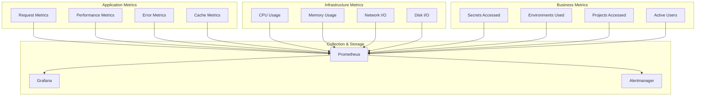
```mermaid
graph TB
    subgraph "Application Metrics"
        REQ[Request Metrics]
        PERF[Performance Metrics]
        ERROR[Error Metrics]
        CACHE[Cache Metrics]
    end

    subgraph "Infrastructure Metrics"
        CPU[CPU Usage]
        MEM[Memory Usage]
        NET[Network I/O]
        DISK[Disk I/O]
    end

    subgraph "Business Metrics"
        SECRETS[Secrets Accessed]
        ENVS[Environments Used]
        PROJECTS[Projects Accessed]
        USERS[Active Users]
    end

    subgraph "Collection & Storage"
        PROM[Prometheus]
        GRAF[Grafana]
        ALERT[Alertmanager]
    end

    REQ --> PROM
    PERF --> PROM
    ERROR --> PROM
    CACHE --> PROM

    CPU --> PROM
    MEM --> PROM
    NET --> PROM
    DISK --> PROM

    SECRETS --> PROM
    ENVS --> PROM
    PROJECTS --> PROM
    USERS --> PROM

    PROM --> GRAF
    PROM --> ALERT
```

### Logging Strategy

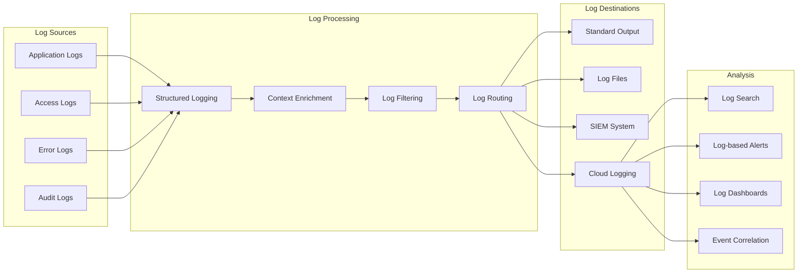
```mermaid
graph LR
    subgraph "Log Sources"
        APP[Application Logs]
        ACCESS[Access Logs]
        ERROR[Error Logs]
        AUDIT[Audit Logs]
    end

    subgraph "Log Processing"
        STRUCT[Structured Logging]
        CONTEXT[Context Enrichment]
        FILTER[Log Filtering]
        ROUTE[Log Routing]
    end

    subgraph "Log Destinations"
        STDOUT[Standard Output]
        FILE[Log Files]
        SIEM[SIEM System]
        CLOUD[Cloud Logging]
    end

    subgraph "Analysis"
        SEARCH[Log Search]
        ALERT_LOG[Log-based Alerts]
        DASHBOARD[Log Dashboards]
        CORRELATION[Event Correlation]
    end

    APP --> STRUCT
    ACCESS --> STRUCT
    ERROR --> STRUCT
    AUDIT --> STRUCT

    STRUCT --> CONTEXT
    CONTEXT --> FILTER
    FILTER --> ROUTE

    ROUTE --> STDOUT
    ROUTE --> FILE
    ROUTE --> SIEM
    ROUTE --> CLOUD

    CLOUD --> SEARCH
    CLOUD --> ALERT_LOG
    CLOUD --> DASHBOARD
    CLOUD --> CORRELATION
```

### Distributed Tracing

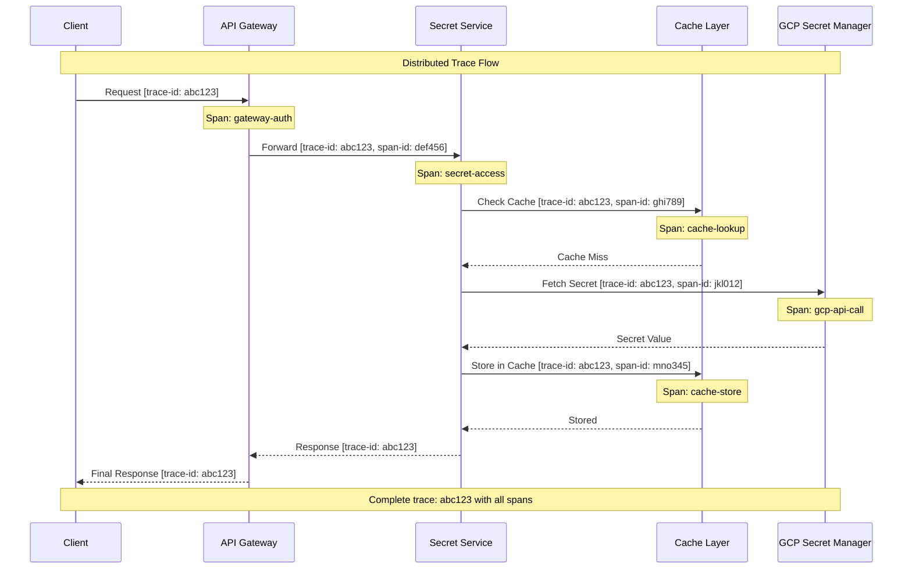
```mermaid
sequenceDiagram
    participant Client as Client
    participant Gateway as API Gateway
    participant Service as Secret Service
    participant Cache as Cache Layer
    participant GCP as GCP Secret Manager

    Note over Client,GCP: Distributed Trace Flow

    Client->>Gateway: Request [trace-id: abc123]
    Note over Gateway: Span: gateway-auth
    Gateway->>Service: Forward [trace-id: abc123, span-id: def456]

    Note over Service: Span: secret-access
    Service->>Cache: Check Cache [trace-id: abc123, span-id: ghi789]
    Note over Cache: Span: cache-lookup
    Cache-->>Service: Cache Miss

    Service->>GCP: Fetch Secret [trace-id: abc123, span-id: jkl012]
    Note over GCP: Span: gcp-api-call
    GCP-->>Service: Secret Value

    Service->>Cache: Store in Cache [trace-id: abc123, span-id: mno345]
    Note over Cache: Span: cache-store
    Cache-->>Service: Stored

    Service-->>Gateway: Response [trace-id: abc123]
    Gateway-->>Client: Final Response [trace-id: abc123]

    Note over Client,GCP: Complete trace: abc123 with all spans

```
